<h1 align='center'> &nbsp;</h1>
<h1  align='center'>👕라이브 커머스 프로젝트</h1>

## 목차
- [개요](https://github.com/YoungQWER/LiveCommerce#-개요)
- [기술 스택](https://github.com/YoungQWER/LiveCommerce#-기술-스택)
- [프로젝트 설계](https://github.com/YoungQWER/LiveCommerce#-프로젝트-설계)
- [핵심 기능](https://github.com/YoungQWER/LiveCommerce#-핵심-기능)
- [주요기능 실행화면](https://github.com/YoungQWER/LiveCommerce#-주요기능-실행화면)
- [개선사항](https://github.com/YoungQWER/LiveCommerce#--개선사항)

## 🚩 개요
- 프로젝트 목표 : 다양한 `API`를 활용한 `스프링` , `마이바티스` 라이브 커머스 프로젝트
- 개발기간 : 24/05/02 ~ 24/05/24

## 🔧 기술 스택
- API : `카카오페이 API`
- Language : `Java(11)` `JavaScript(3.22)`
- Library & Framework : `Spring(5.3.23)` `Junit(4.12)` `Servlet(4.0.1)` `Spring Security` `websocket(5.2.7)` `JSP(2.5)`
- Database : `MySQL(8.0.35)`
- Target : `Web Browser`
- Tool : `SpringSource Tool Suite (STS) 3.9.18.RELEASE`
- Infra : `Linux(Ubuntu)` `EC2`
- Etc : `Git`

## 👾 프로젝트 설계, 구현 📂 PPT 📂 (ERD, USECASE)

프로젝트 설계, 구현, PPT 눌러서 확인
   

   

| **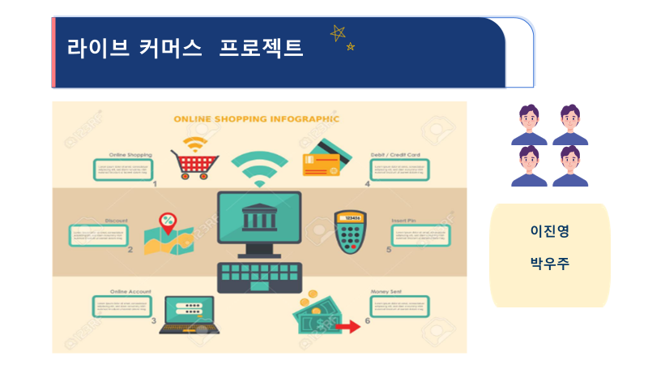|** | **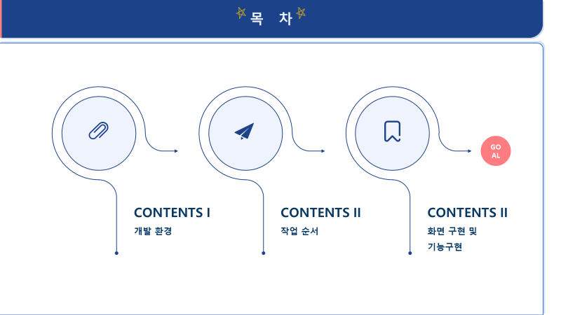** |
| :------: |  :------: |
| 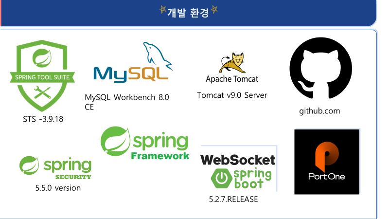| | 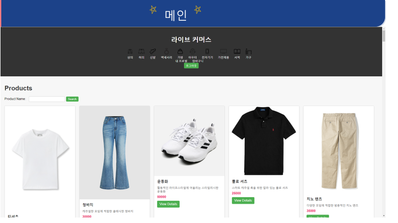 | | 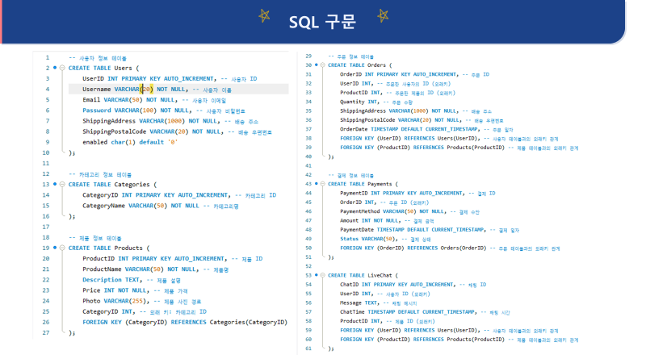 | | 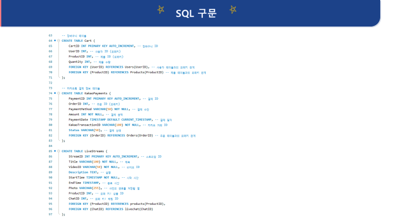 | |  | | 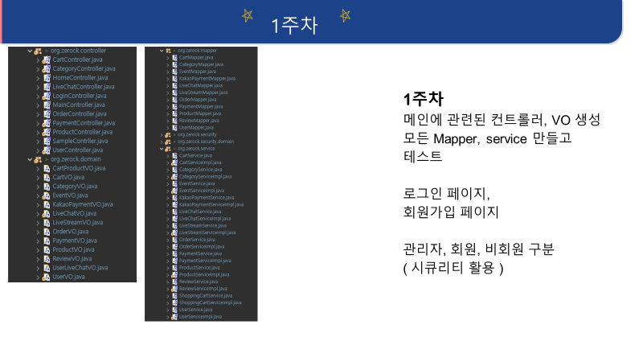 | | 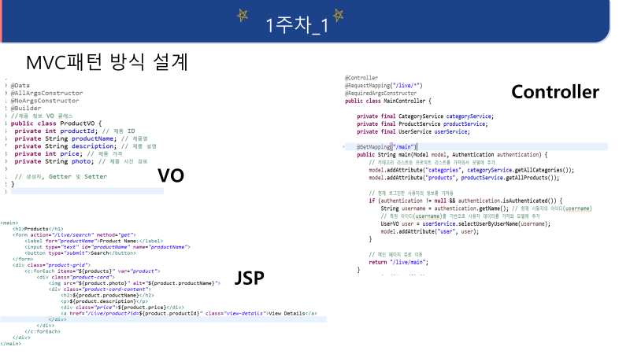 | | 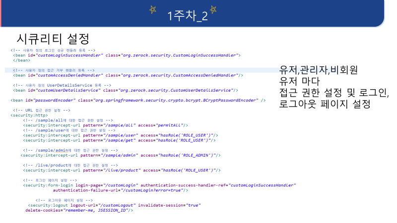 | | 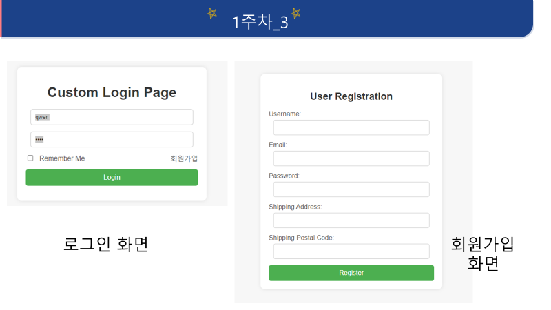 | | 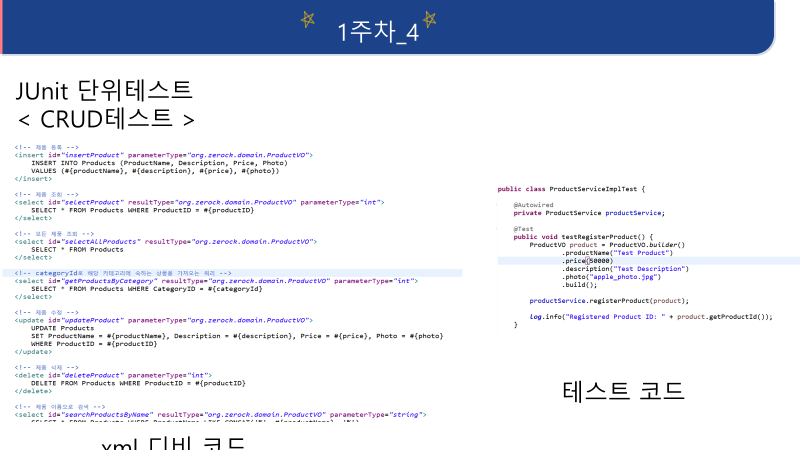 | | 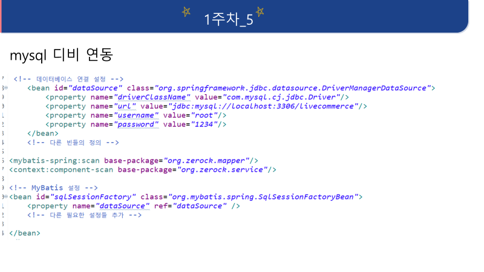 | | 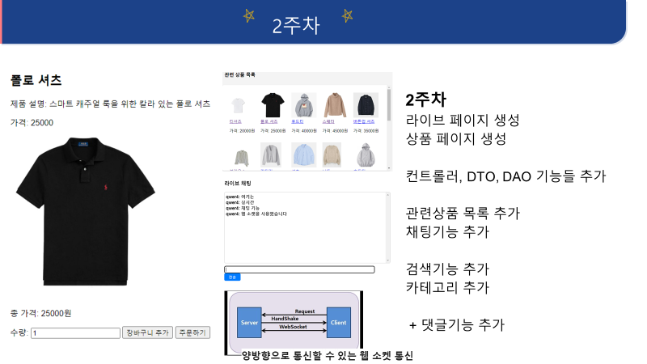 | | 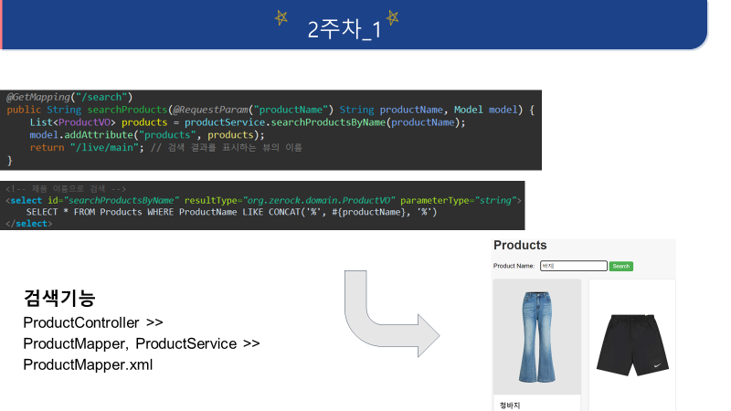 | | 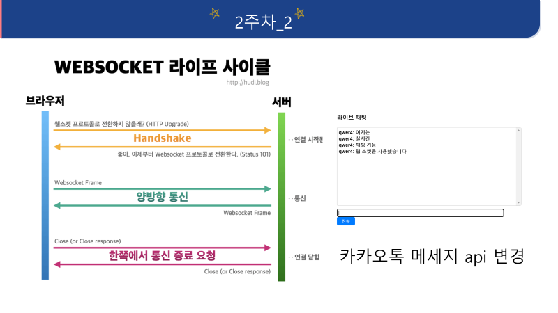 | |  | | 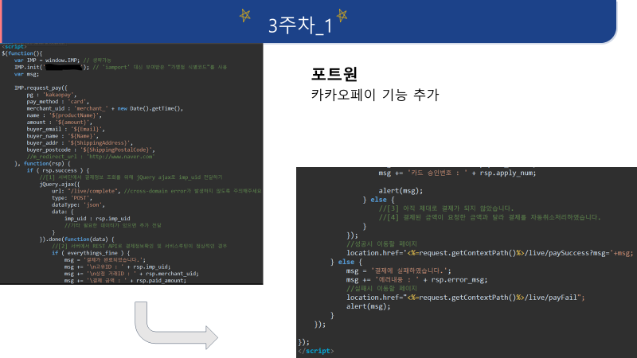 | | 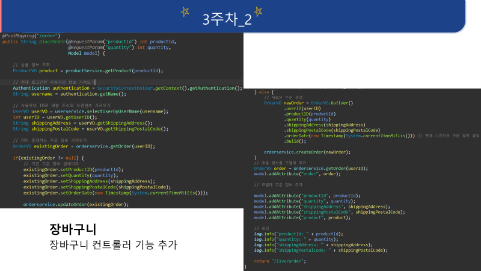 | | 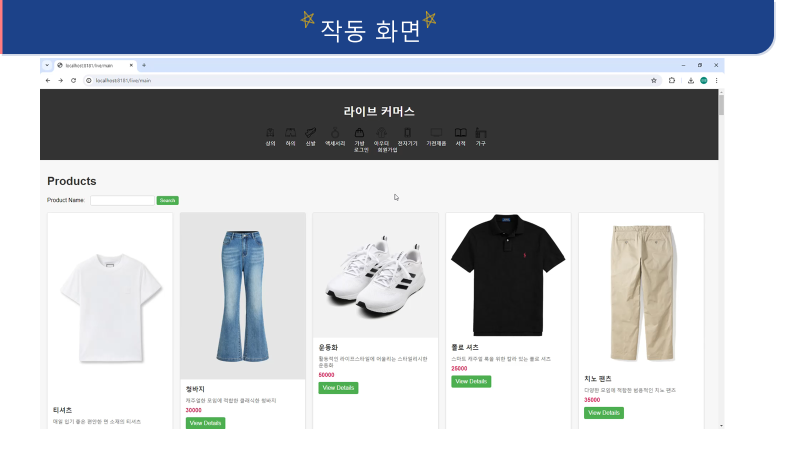 | | 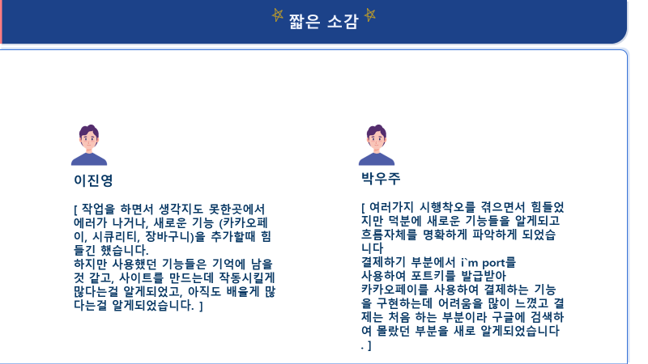 | | 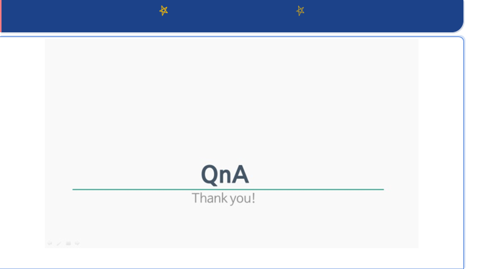 |

            

## 💻 핵심 기능

#### 상품
- 

#### 유저
- 

#### 장바구니
- 

#### 주문
- 

## 🎇 주요기능 실행화면

주요기능 실행화면 눌러서 확인

## 🚩 문제점
- 테스트때 NULL값이 넘어가서 오류가 뜰때
- 생각지도 못한 DB join으로 다시 설정해야될때
- 시큐리티 토큰

## 🌄 개선사항
- 관리자 CRUD 추가
- 장바구니 구매 후 삭제
 
