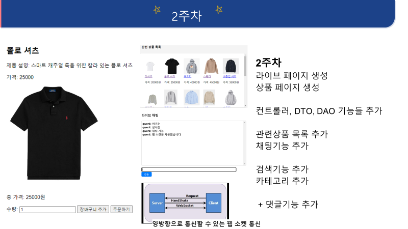
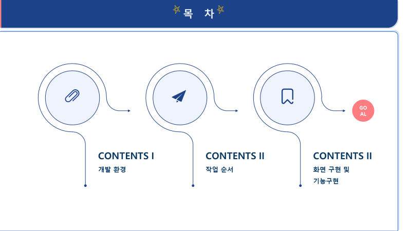
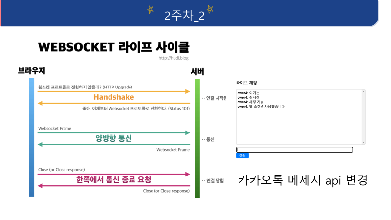
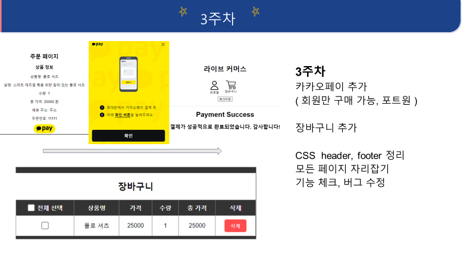

<h1  align='center'>👕스프링 의류 쇼핑몰 프로젝트</h1>

## 목차
- [개요])
- [기술 스택]()
- [프로젝트 설계]()
- [핵심 기능]()
- [주요기능 실행화면]()
- [개선사항]()
  

## 🚩 개요
- 프로젝트 목표 : 다양한 `API`를 활용한 `스프링` , `마이바티스` 의류 쇼핑몰 프로젝트
- 개발기간 : 24/05/02 ~ 24/05/24

## 🔧 기술 스택
- API : `카카오페이 API`
- Language : `Java(11)` `JavaScript(3.22)`
- Library & Framework : `Spring(5.3.23)` `Junit(4.12)` `Servlet(4.0.1)` `Spring Security` `websocket(5.2.7)`
- Database : `MySQL(8.0.35)`
- Target : `Web Browser`
- Tool : `SpringSource Tool Suite (STS) 3.9.18.RELEASE`
- Infra : `Linux(Ubuntu)` `EC2`
- Etc : `Git`

## 👾 프로젝트 설계, 구현 📂 PPT 📂 (ERD, USECASE)

프로젝트 설계, 구현, PPT
   

   

|| ||
| :------: |  :------: |
|| || || || || || || || |||| || || || || || |||| || || || || || ||

            

